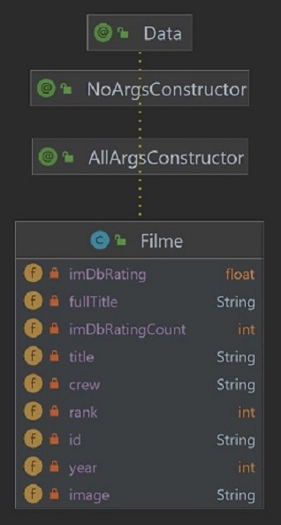

# Alura - 7 Days Of Code - Back-End - Java - Spring - IMDB

Projeto do 7 Days of Code de Spring da Alura: Consumindo a API de filmes do IMDB e criando uma página HTML de exibição.

## Atividades

### Dia 1:
- Criar projeto com Spring Boot.

- ~~Cadastrar no site IMDB para obter chave da API.~~
- ~~Colocar a Chave da API em `application.properties` mas não compartilhá-la.~~
- Criar a classe RestTemplateConfig que tem um método com `@Bean` que retorna uma instância de RestTemplate.
- Criar a classe ImdbController e implementar método de getmapping para `/imdb` usando a url para o dados. 

- Testar o endpoint `http://localhost:8080/imdb`

### Dia 2:
- Remover o campo `imdbApiKey` de ImdbController e seu valor de `application.properties`, já que os dados serão obtidas via url do github.
- Alterar classe de teste `Alura7DaysOfCodeBackEndJavaSpringImdbApplicationTests`:
  * Anotar a classe com `@SpringBootTest(webEnvironment = SpringBootTest.WebEnvironment.RANDOM_PORT)`.
  * Criar atributo `porta` e anotá-lo com `@LocalServerPort`.
  * Criar atributo `restTemplate` do tipo `TestRestTemplate` e anotá-lo com `@Autowired`.
  * Criar método `testImdbEndpoint`para testar o endpoint `http://localhost:8080/imdb`.

### Dia 3:
- Criar classe Filme e usar Lombok para gerar getters, setters e construtores.

- Adicionar dependência do GSON `implementation group: 'com.google.code.gson', name: 'gson', version: '2.10.1'` em `build.gradle`.
- Alterar método da controller para que o retorno tenta uma List de Filmes ao invés de uma String.
- Alterar o método da classe de teste para verificar o retorno do tipo List e não String.

### Dia 4:
- Criar classe TemplateHTML com campos `INICIO_HTML`, `FILME_HTML` e `FIM_HTML`;

- Criar Classe GeradorHTML com método `gerarStringHTML()`;

- Refatorar a classe ImdbController:
  * Tornar `fetchTopMoviesData()` privado e remover endpoint `http://localhost:8080/imdb`.
  * Criar endpoint `http://localhost:8080/imdb/json` e testá-lo.
  * Criar endpoint `http://localhost:8080/imdb/html` e testá-lo.
  * Criar endpoint `http://localhost:8080/imdb/html-download` e testá-lo.

- Alterar classe de teste `Alura7DaysOfCodeBackEndJavaSpringImdbApplicationTests`:
  * Deletar o método `testImdbEndpoint()`.
  * Criar método `testImdbEndpoint_JSON()`para testar o endpoint `http://localhost:8080/imdb/json`.
  * Criar método `testImdbEndpoint_HTML()`para testar o endpoint `http://localhost:8080/imdb/html`.

### Dia 5:
- Refatorar o código, delegando parte das responsabilidades de ImdbController para outras classes.
- Criar classe ImdbClientFetch:
  * terá um atributo RestTemplate e um String (URL).
  * terá o método `fetchTopFilmes()` extraido de `fetchTopMoviesData()` de ImdbController;
  * anotada com `@Component`.

- Criar classe ImdbService:
  * terá um atributo ImdbClientFetch e um GeradorHTML;
  * terá métodos `jsonTopFilmes()`, `htmlTopFilmes()` e `downloadHtml()` extraídos dos métodos públicos de ImdbController;
  * anotada com `@Service`.

- A classe ImdbController terá apenas um atributo, do tipo ImdbService.
  

### Dia 6:

- Adicionar 3 novos endpoints que serão similares aos já criados, mas recebem parte do título na url e retornam os correspondentes:
  * Adicionar novos métodos para as classes ImdbController e ImdbService.

  * Criar endpoint `http://localhost:8080/imdb/json/{titulo}` e testá-lo.
  * Criar endpoint `http://localhost:8080/imdb/html/{titulo}` e testá-lo.
  * Criar endpoint `http://localhost:8080/imdb/html-download/{titulo}` e testá-lo.

## Referências

Alura - 7 Days Of Code - Back-End - Java - Spring:
https://7daysofcode.io/matricula/spring

Spring Framework - Docs - Rest Template: 
https://docs.spring.io/spring-framework/docs/current/javadoc-api/org/springframework/web/client/RestTemplate.html

Baeldung Rest Template:
https://www.baeldung.com/rest-template

Imdb Top Filmes:
https://raw.githubusercontent.com/alura-cursos/imersao-java-2-api/main/TopMovies.json